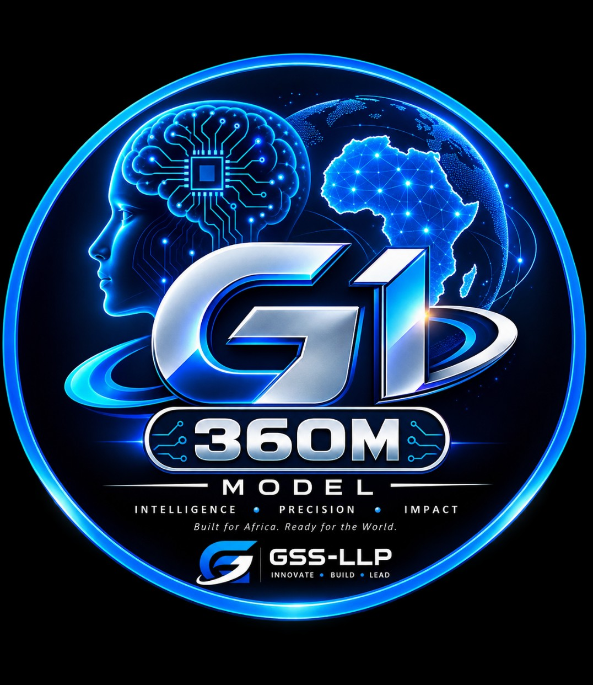
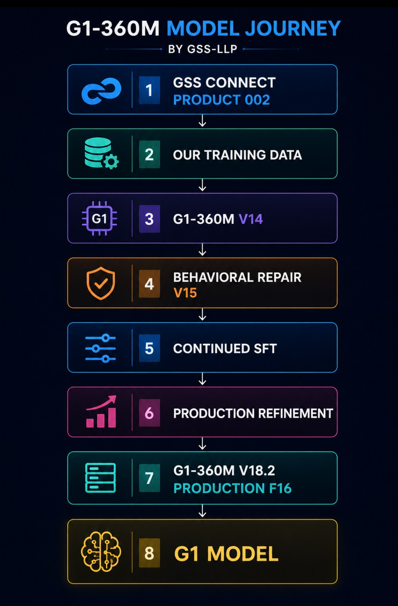
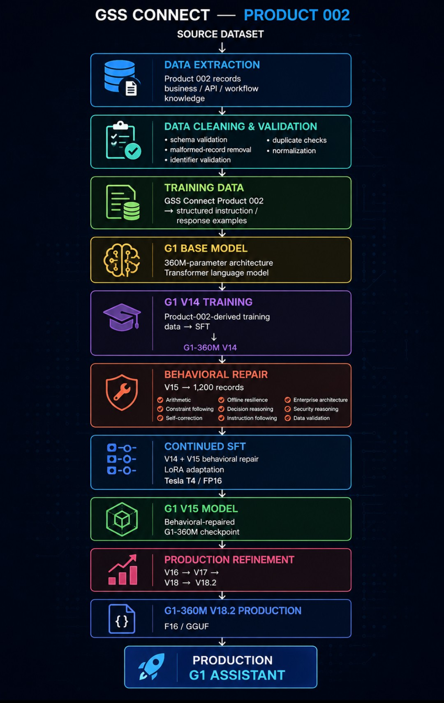
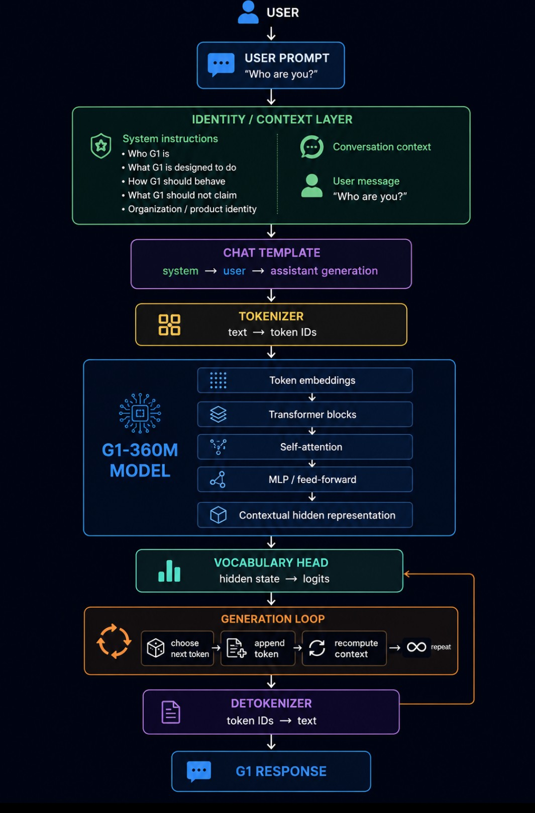

# G1-360M V18.2 — ADTC 2026 Submission

**Team:** Gaston Software Solutions LLP (GSS-LLP)
**Track:** Corporate Enterprise
**Model:** G1-360M_V18.2_PRODUCTION_F16
**Hugging Face:** https://huggingface.co/gsstec/G1-360M_V18.2_PRODUCTION_F16

---



**G1-360M V18.2** is a compact, production-ready enterprise AI model built by **Gaston Software Solutions LLP (GSS-LLP)**, Kampala, Uganda — designed to run fully offline on a laptop and reason about real business systems, enterprise workflows, APIs, data validation, and security controls.

> **Runs on 8 GB RAM.** G1-360M V18.2 (GGUF F16) is designed for the standard 8 GB laptop profile. When running through **Ollama desktop**, the model loads efficiently and can operate with as little as 4 GB of available RAM, making it practical for offline enterprise environments on any modern laptop or workstation.

---

## ✅ Submission Checklist

- [x] Repository is **public** on GitHub
- [x] `metadata.json` fully filled in — no placeholder values remain
- [x] `metadata.json` contains exactly **2 test prompts** in the `test_prompts` array
- [x] `download_model.sh` downloads the model to `model/`
- [x] Downloaded file is valid **GGUF F16** format
- [x] `model/*.gguf` is in `.gitignore` — weight file not committed
- [x] `REPORT.md` filled in with full technical writeup
- [x] Model runs entirely **offline** — zero external network calls during inference
- [x] African Use Case Bonus claimed (`african_alpha_claim: true`)

---

## Model Journey

How G1 was built — from proprietary enterprise data to production model:



---

## Training Pipeline

The full training pipeline from source data to G1-360M V18.2 Production F16:



---

## How It Works

G1's inference architecture — from user prompt to enterprise response:



---

## Quick Start

```bash
# 1. Download the model weights (~690 MB)
bash download_model.sh

# 2. Run with llama.cpp
llama-cli \
  -m model/G1-360M_V18.2_PRODUCTION_F16.gguf \
  --chat-template chatml \
  -p "A payment API receives a transaction ID from an untrusted caller. What validation steps must occur before the ID is used to authorize the payment?" \
  -n 256

# 3. Or run as a local server
llama-server \
  -m model/G1-360M_V18.2_PRODUCTION_F16.gguf \
  --chat-template chatml \
  --port 8080
```

---

## Model Identity

| Property | Value |
|---|---|
| Model | G1-360M V18.2 |
| Release | Production F16 |
| Developer | Gaston Software Solutions LLP (GSS-LLP) |
| Parameters | ~360M |
| Format | GGUF F16 |
| RAM required | ~782 MB RSS measured; 8 GB headroom recommended (4 GB with Ollama desktop) |
| Runtime | llama.cpp |
| Domain | Corporate enterprise |
| License | G1-360M Commercial License |
| Hugging Face | [gsstec/G1-360M_V18.2_PRODUCTION_F16](https://huggingface.co/gsstec/G1-360M_V18.2_PRODUCTION_F16) |

---

## Enterprise Capabilities

G1 is designed to assist with practical enterprise reasoning:

- Business workflow analysis and transaction flow reasoning
- Enterprise architecture and system component analysis
- API and integration troubleshooting
- Security controls and authorization reasoning
- Data validation and identifier verification
- Decision reasoning with explicit trade-offs
- Offline resilience and business continuity
- Operational process support

---

## Developer

**Gaston Software Solutions LLP (GSS-LLP)**
Registration No. **80041130611335** — Kampala, Uganda

| Contact | Detail |
|---|---|
| Website | https://www.gss-tec.com |
| Email | info@gss-tec.com |
| Telephone | +256 755 274955 |
| LinkedIn | Gaston Software Solutions LLP |

---

## License

G1-360M V18.2 is distributed under the **G1-360M Commercial License**.

Full license: **https://www.g1-license.gss-tec.com/**

The license permits corporate and enterprise use, fine-tuning, customization, and embedding into commercial products and services.

---

## Files

| File | Purpose |
|---|---|
| `metadata.json` | Team, model, domain, and test prompt metadata |
| `download_model.sh` | Downloads GGUF weights from Hugging Face |
| `REPORT.md` | Full technical writeup |
| `model/` | Downloaded model weights (not committed — see `.gitignore`) |
